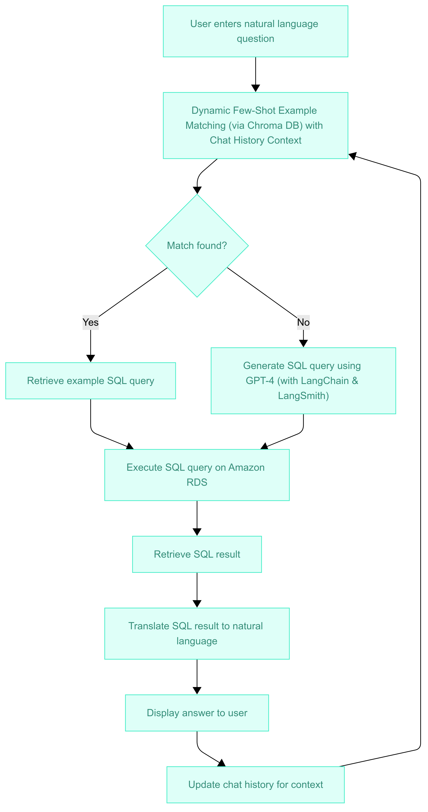

# NaturalLanguage2SQL
QueryMaster converts natural language questions into SQL, querying cloud databases like Amazon RDS. It matches questions via Chroma DB or generates queries with GPT-4 using LangChain and LangSmith. With history management, it delivers contextual answers.

# Project Overview
This project is a full-stack web application that allows users to ask natural language questions about structured data stored in cloud databases (Amazon RDS / Azure MySQL). The system converts these questions into SQL queries using a dynamic few-shot example matching strategy powered by Chroma DB. If a close match is found, an example SQL is used; otherwise, the system leverages OpenAI's GPT-4 alongside LangChain and LangSmith to generate the SQL query. The generated query is executed against the target database, and the SQL result is translated back into natural language for a user-friendly output. The solution also supports conversational context by integrating chat history, enabling follow-up questions to be understood in context.

# Data Flow Diagram  

# Key Features
Natural Language Interface: Users interact with data using everyday language.  
Dynamic Few-Shot Learning: Leverages example questions and SQL pairs stored in Chroma DB.  
AI-Driven Query Generation: Utilizes GPT-4 for generating SQL queries when no suitable match is found.  
Cloud Database Connectivity: Supports Amazon RDS and Azure MySQL.  
Conversational Context: Maintains chat history to support follow-up questions.  
Web Application Interface: Built with Streamlit for a seamless user experience.

# Tech Stacks:
  
Frontend: Streamlit  
Backend: Python  
AI & NLP: OpenAI GPT-4, LangChain, LangSmith  
Data Matching: Chroma DB (Dynamic Few-Shot Learning)  
Databases: Amazon RDS, Azure MySQL
